# Clara AGX Developer Kit User Guide

**Purpose:** Provides the instructions to flash, setup, and start using a Clara AGX Developer Kit. 

**Disclaimer: The Clara AGX Developer Kit is not an approved medical device and is not**
**intended for clinical use.**

**Version:** 2.0
____________________________________________________________________________________________________

## Contents
1. [Changes Since Last Update](#changes-since-last-update)
2. [Checklist for Setting Up the Developer Kit](#checklist-for-setting-up-the-developer-kit)
3. [Hardware Setup](#hardware-setup)
    - [Requirements](#requirements)
    - [Precautions](#precautions)
4. [System Overview](#system-overview)
    - [Main Components](#main-components)
    - [Tech Specs](#tech-specs)
    - [I/O and External Interfaces](#io-and-external-interfaces)
5. [Powering Up the System](#powering-up-the-system)
6. [Flashing and Updating Clara AGX Developer Kit using the SDK Manager](#flashing-and-updating-clara-agx-developer-kit-using-the-sdk-manager)
7. [Check Firmware Version and Manually Update if Needed](#check-firmware-version-and-manually-update-if-needed)
8. [Switching between iGPU and dGPU](#switching-between-igpu-and-dgpu)
9. [Enabling the HDMI Input](#enabling-the-hdmi-input)
10. [Setting up SSD Storage](#setting-up-ssd-storage)
11. [Create a Partition](#create-a-partition)
12. [Mount the Partition](#mount-the-partition)
13. [Setting up Docker and Docker Storage on SSD](#setting-up-docker-and-docker-storage-on-ssd)
14. [Install the Clara Holoscan SDK](#install-the-clara-holoscan-sdk)
15. [Known Issues and Troubleshooting](#known-issues-and-troubleshooting)
16. [Additional Resources](#additional-resources)
17. [Compliance Information](#compliance-information)
18. [Update Nvidia drivers](#update-nvidia-drivers)

## Changes Since Last Update
Note on dGPU only support in SDK:
   * Added tip for inspecting normal/recovery mode the system.
   * Boots into before flashing; removed subsection “Reinstalling Optional SDK Packages.”
   * Added troubleshooting item for “cannot connect to the device via SSH” error during flashing.
   * Reorganized sections.

## Checklist for Setting up the Developer Kit
After receiving the Clara AGX Developer Kit, ensure the following actions are taken before
developing on the kit. Each action is described in its corresponding section of this user guide.

* Read through the Hardware Setup requirements and precautions. 
* Familiarize yourself with the System Overview: the main components and system I/O. 
* Power up the system.
* Flash and Update the CLara AGX Developer Kit with Holopack using SDK Manager.
* Check the firmware version and manually update it if needed. 
* Switch from iGPU to dGPU mode.
* Set up the 250GB SSD storage.
* Set up Docker and Docker storage.
* Install the Clara Holoscan SDK from Github.

**Note: The current Clara Holoscan SDK is only tested in dGPU mode; therefore, switching**
**from iGPU to dGPU is essential. Running the SDK in iGPU is not supported at the moment.**

## Hardware Setup
#### Requirements
* A Clara AGX Developer Kit 
* A compatible power cable 
    * The NVIDIA Clara AGX Developer Kit may not include a power cable compatible
     with your local electrical requirements.  
    * A compatible cable should meet the following requirements:  
        * Provides a certified local 3-prong AC power plug 
        * Provides a C13 connector 
        * Supports ratings of 100-120VAC/6A, 200-240VAC/3A, or higher with a 
          minimum wire thickness of 18AWG and insulation rating of 300V or higher. 
* An Ubuntu 18.04 / 20.04 host system (for use during flashing) 
* A standard USB-A to USB-C or USB-C to USB-C cable with data enabled (for use during flashing) 
* Connection to the Internet for the host system before and during flashing, and for the 
  Clara AGX Developer Kit during flashing 
* A keyboard, mouse, and monitor with HDMI for the Clara AGX Developer Kit 
#### Precautions 
* Only connect and disconnect a PCIe card (e.g. miniSAS or dGPU) when the system is powered down. 
* Apply extra care when plugging and removing PCIe cards to avoid stress on the PCIe
  connectors (wearing, bending, breaking). 
* The rightmost USB connector is USB 2.0 (even if the color is blue). The other two USB
  connectors are USB 3.0. 

## System Overview
#### Main Components
The Clara AGX Developer Kit contains the following major components: 
* [AGX Xavier 32 GB Module](https://www.nvidia.com/en-us/autonomous-machines/embedded-systems/jetson-agx-xavier/)
* [RTX 6000 discrete GPU](https://www.nvidia.com/en-us/design-visualization/previous-quadro-desktop-gpus/) 
* ConnectX-6 IC 
* 250GB Removable SSD 

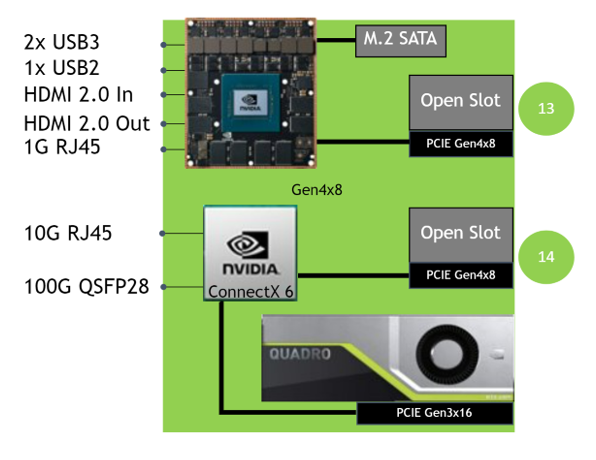

#### Tech Specs
|                  |                                                                               |
| ------------     | -----------                                                                   |
| **CPU**          | 8-core Carmel ARM v8.2 64-bit CPU, 8MB L2 + 4MB L3                            |
| **Memory**       | 32GB 256-Bit LPDDR4x, 136.5GB/s                                               |
| **GPU**          | RTX6000, 24 GB GDDR6, 672 GB/s, 4,608 CUDA cores, 576 Tensor Cores            | 
| **Storage**      | 250GB SSD                                                                     |
| **I/O**          | USB2.0, (2x) USB3.0, USB-C, HDMI In/Out, (4x) DisplayPort, 1/10/100 GbE       |
| **Expansion**    | PCIe x8 (single slot width) to Xavier, PCIe x8 (single slot width) to RTX6000 |
| **Power Supply** | 750W, 100-240V                                                                |
| **Dimensions**   | 227mm W x 149mm H x 332mm L                                                   |

#### I/O and External Interfaces

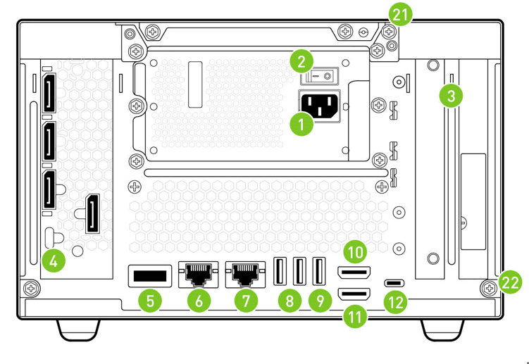

1. Power cable connection 
2. Power switch 
3. PCIe slots for customer cards 
4. dGPU outputs from RTX 6000, including four Display Ports and one mini HDMI port 
    * Reference the [GPU section](#switching-between-iGPU-and-dGPU) below to determine which display output to use. 
5. 100 GbE QSFP28 Ethernet connector to NVIDIA ConnectX-6 
6. 10 GbE RJ45 Ethernet connector to NVIDIA ConnectX-6 
    * The 10GbE connector only supports 10 GbE speeds. 
7. 1 GbE RJ45 Ethernet connector to Xavier module 
8. USB 3.0 ports (2x) 
9. USB 2.0 port (1x) 
10. HDMI out 
    * Reference the [GPU section](#switching-between-iGPU-and-dGPU) below to determine
      which display output to use. 
11. HDMI in: Connect to instruments that output HDMI to the platform. 
12. Debug USB-C port: Connect to the Linux host system for flashing and serial port connections.  

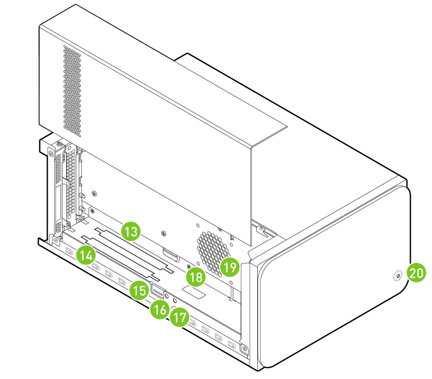

13. x8 PCIe slot (x16 physical) for customer card, to Xavier Module
14. x8 PCIe slot (x16 physical) for customer card, to RTX6000
    * Used for cards supporting GPU Direct RDMA data transfer to RTX6000 GPU
15. SD card slot
16. Recovery button
17. Reset button
18. Main secondary compartment fan connector (there is an additional system fan inside the chassis)
19. Auxiliary fan connector for card fans
20. Power button

To access ports 13-19, remove the left-hand side cover. The process is illustrated below. 
Unscrew the two Phillips screws (21 and 22) that secure the cover at the back of the machine. 
Next, push and slide the cover in the direction towards the back of the machine without lifting 
(step 1). It should slide about 0.5 inch, or less than 1.5 cm. Finally, you should be able to lift 
the cover off once it has more than one degree of freedom and can be easily lifted upwards (step 2).

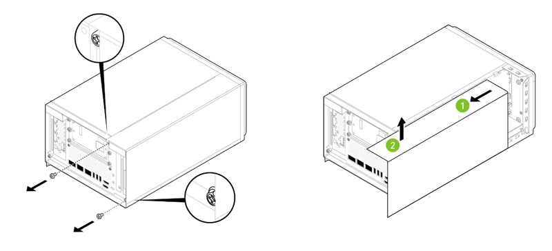

## Powering Up the System

1. Connect all peripherals to the system before powering up the system.
2. Connect the power cable to the system in the slot labeled (1) in the graphic above.
3. Once the power is connected, press the power button (20) for less than 1 second.
   It should light up.
4. If you have a display connected, you might already see the system booting on it. 
   During flashing or re-flashing, use the HDMI output port (10) to connect to the display. 
   Once the system is set up and running in dGPU mode, connect your display to 
   one of the DisplayPorts (4). Reference the [GPU section](#_Switching_between_iGPU) below to
   determine how to choose between display outputs in different modes.

**Note** : The machine can be powered off by depressing the power button for approximately 10 seconds.

## Flashing and Updating Clara AGX Developer Kit using the SDK Manager

1. Register and activate an NVIDIA Developer Account [here](https://developer.nvidia.com/clara-holoscan-sdk-program) to access the latest version of Holopack in SDK Manager.
2. If you are running a VPN on your host system, log off before flashing the Clara AGX Developer Kit.
3. Using a VM as your host machine isn't officially supported, but it is possible with certain
   VMs such as VMWare Workstation 16 running Ubuntu 18.04. If using a VM, ensure the USB port that
   connects to the USB-C port on the Clara AGX Developer Kit is always routed to the VM.
4. From the host system, download and install the latest version of [NVIDIA SDK Manager](https://developer.nvidia.com/nvidia-sdk-manager). Instructions for downloading and setting up NVIDIA SDK Manager can be found [here](https://docs.nvidia.com/sdk-manager/download-run-sdkm/index.html). **Make sure to log in with the same developer account in SDK Manager.**
5. Connect the Clara AGX Developer Kit to the host system via USB-C (12).
6. From the NVIDIA SDK Manager, download and flash the Clara AGX Developer Kit. See the [step-by-step instructions](https://docs.nvidia.com/sdk-manager/install-with-sdkm-clara/index.html) for more details.

The devkit could boot into either normal mode or recovery mode. Inspect the mode in SDK Manager by hovering with the mouse pointer of the "i" icon next to "Clara AGX Developer Kit".

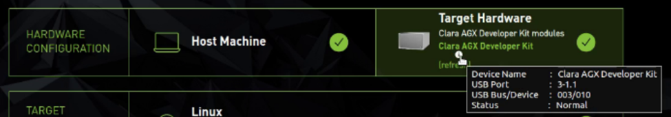

   **Note** :We recommend setting the unit to reset mode for the flashing process and selecting
   "Manual Setup" mode in the prompt at Step 03 in the SDK Manager; it has been observed that
   flashing can get stuck in "Automatic Setup" mode.
   * If you joined the Clara Holoscan SDK program after your initial SDK Manager login,
      you will need to log out   and log in again on SDK Manager for the permissions to take effect.
   * Follow these steps to reset the Clara AGX Developer Kit:
        1. Remove the left-hand side cover to expose ports 13-19.
        2. Make sure the unit is powered on.
        3. Press and hold the Recovery button (16), then press and hold the Reset button (17), 
           finally release both buttons.
   * If resetting the unit doesn't work, try putting the unit into recovery mode:
        1. Power off the unit.
        2. Remove the left-hand side cover to expose ports 13-19
        3. Hold down the Recovery button (16) while pressing the Power button (20) to turn on the unit.
        4. Release the Power Button, then the Recovery button.
7. We recommend putting the Clara AGX Developer Kit into reset mode during flashing, but if you need to know the default credentials when SDK Manager is preparing to flash the Clara AGX Developer Kit, they are shown below:
    * Username: ubuntu
    * Password: ubuntu

## Check Firmware Version and Manually Update if Needed

If you are a current user of the Clara AGX Developer Kit and have flashed it before, check the firmware version. If needed, update the firmware on the devkit before moving on to the next step of flashing Holopack. Without the firmware update, you might experience Known Issue #1 once Holopack is installed.

If you are a new user of the Clara AGX Developer Kit and have not flashed it before, follow the rest of this document to set up your devkit, then come back to this section to check and update your firmware after switching to dGPU mode.

1. Install the tools for checking and updating the firmware version:
```
$ sudo apt install mstflint
```

2. Check the device address for "Ethernet controller: Mellanox Technologies MT28908 Family [ConnectX-6]". The old firmware uses the 0000:09:00.0 address, while the up-to-date firmware should use 0000:03:00.0.
```
$ lspci | grep Mellanox
```

3. Run the following command using the device address obtained in step 2 to check the firmware
   version. If you see a version lower than 20.33.1048, then a firmware update is needed.
   Otherwise, there's no need to update your firmware, and you can skip steps 4 - 7.
```
$ sudo mstflint -d 0000:09:00.0 q full
…
FW Version:            20.27.4006  <- Update is needed
… 
$ sudo mstflint -d 0000:03:00.0 q full
…
FW Version:            20.33.1048  <- Firmware is already updated
…
```

4. Download the new firmware from [here](https://developer.nvidia.com/assets/embedded/secure/tools/files/jetpack-sdks/jetpack-5.0-hp/fw-connectx6-rel-20_33_1048-nvidia_mccoy_lom_pcie_switch_ax.zip) and unzip it.

5. Install the new firmware using the following command:
```
$ sudo mstflint -d 0000:09:00.0 -i fw-ConnectX6-rel-20_33_1048-Nvidia_McCoy_LOM_PCIe_switch_Ax.bin burn
```

6. Reboot the Clara AGX Developer Kit.

7. Check the newly installed firmware has the correct version:
```
$ sudo mstflint -d 0000:03:00.0 q full
…
FW Version:            20.33.1048
… 
```

## Switching between iGPU and dGPU
The Clara AGX Developer Kit can use either the Xavier AGX module GPU (iGPU, integrated GPU)
or the RTX6000 add-in card GPU (dGPU, discrete GPU). You can only use one type of GPU at a time.

By default, the Clara AGX Developer Kit uses the iGPU. Switching between the iGPU and dGPU
is performed using the *nvgpuswitch.py* script located in the */opt/nvidia/l4t-gputools/bin/directory*.
To make the *nvgpuswitch.py* script accessible globally, copy it to a directory included in *$PATH* if it hasn't been already:
```
$ sudo cp /opt/nvidia/l4t-gputools/bin/nvgpuswitch.py /usr/local/bin/
```

To switch from the iGPU to the dGPU, follow these steps:

1. Connect the Clara AGX Developer Kit to the Internet using one of the following methods:
    * An Ethernet cable connected to a router or Wi-Fi extender
        1. Use the 1GbE connector to the Xavier module at port 7.
    * A USB Wi-Fi receiver
        1. Not all USB Wi-Fi receivers will work out of the box on the Clara AGX Developer Kit.
        2. The USB Wi-Fi receiver should have support for Ubuntu 20.04.
        3. The TP-Link Archer T2U Nano USB Wi-Fi Adapter, which has previously worked with the Ubuntu 18.04 Holoscan SDK versions, will no longer work with Holoscan SDK v0.2, which based on Ubuntu 20.04.

2. To view the currently installed drivers and their version, use the _query_ command:
```
$ nvgpuswitch.py query
iGPU (nvidia-l4t-cuda, 34.1.2-20220613164700)
```

3. To install the dGPU drivers, use the _install_ command with the *dGPU* parameter (note that *sudo* must be used to install drivers):

```
$ sudo nvgpuswitch.py install dGPU
```
    
   The *install* command prints out the list of commands that will be executed as part of the driver install and then continues to execute those commands. This aids with debugging if any of the commands fail to execute.

   The following arguments may also be provided with the *install* command :
```    
$ nvgpuswitch.py install -h
usage: nvgpuswitch.py install [-h] [-f] [-d] [-i] [-v] [-l LOG] [-r [L4T_REPO]] {iGPU,dGPU}
 
positional arguments:
  {iGPU,dGPU}           install iGPU or dGPU driver stack
 
optional arguments:
  -h, --help            show this help message and exit
  -f, --force           force reinstallation of the specified driver stack
  -d, --dry             do a dry run, showing the commands that would be executed but not actually executing them
  -i, --interactive     run commands interactively (asks before running each command)
  -v, --verbose         enable verbose output (used with --dry to describe the commands that would be run)
  -l LOG, --log LOG     writes a log of the install to the specified file
  -r [L4T_REPO], --l4t-repo [L4T_REPO]
                        specify the L4T apt repo (i.e. when using an apt mirror; default is repo.download.nvidia.com/jetson) 
```
4. The dGPU driver install may be verified using the *query* command:
```
$ nvgpuswitch.py query
dGPU (cuda-drivers, 510.73.08-1)
Quadro RTX 6000, 24576 MiB
```

5. After the dGPU drivers have been installed, rebooting the system will complete
   the switch to the dGPU. At this point the Ubuntu desktop will be output via DisplayPort on the dGPU,
   so the display cable must be switched from the onboard HDMI (port 10) to DisplayPort (port 4)
   on the dGPU. 

    **Note** : If the output connection isn't switched before the Clara AGX Developer Kit
    finishes rebooting, the terminal screen will hang during booting.

6. Modify the PATH and LD\_LIBRARY\_PATH . CUDA installs its runtime binaries such as nvcc
into its own versioned path, which is not included by the default $PATH environment variable.
Because of this, attempts to run commands like nvcc will fail on dGPU unless the CUDA 11.6 path
is added to the $PATH variable. To add the CUDA 11.6 path for the current user,
add the following lines to $HOME/.bashrc after the switch to dGPU:
```
export PATH=/usr/local/cuda-11.6/bin:$PATH
export LD_LIBRARY_PATH=/usr/local/cuda-11.6/lib64:$LD_LIBRARY_PATH
```

At this time, the Clara Holoscan SDK is tested and supported only in dGPU mode. Switching back
to iGPU mode after switching to dGPU mode is not recommended.

**Note:** The GPU settings will persist through reboots until it is changed again with *nvgpuswitch.py*.

## Enabling the HDMI Input
The Clara AGX Developer Kit includes an HDMI input (port 11), which is connected internally to
the Jetson CSI interface. Holopack does not configure this CSI interface by default to enable
the HDMI input board, so this configuration must be done manually one time after Holopack
is flashed onto the device. To do this, run the *jetson-io.py* script and select the following
sequence of options to program the CSI connector pins to be compatible with the HDMI input board.

**Note:** if the options are not visible, resize the terminal window to make it taller.

1. Run the script.
```
$ sudo /opt/nvidia/jetson-io/jetson-io.py
```

2. Select “Configure Jetson AGX Xavier CSI Connector.”

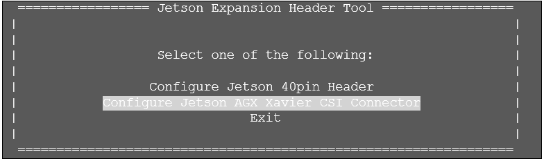

3. Select "Configure for compatible hardware". 

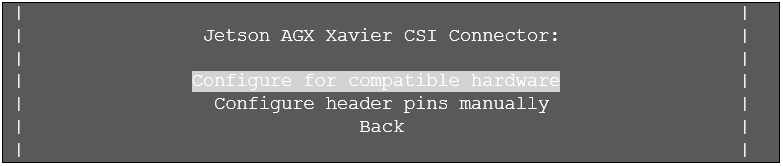

4. Select "Jetson Camera HDMI CSI Bridge".

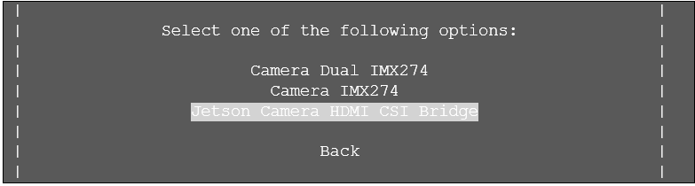

5. Select "Save pin changes".

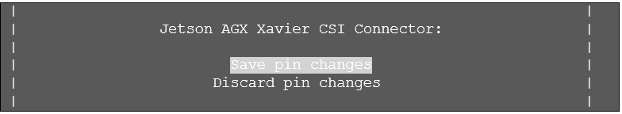

6. Select "Save and reboot to reconfigure pins".

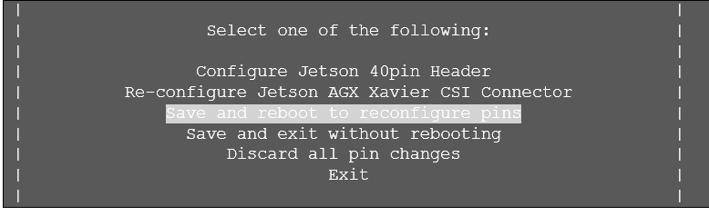

7. Press any key to reboot.

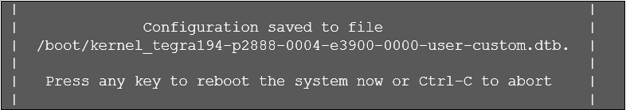

Once the system has rebooted, operation of the CSI input board can be verified using the v4l2ctl
utility to check that the */dev/video0* device is visible and reports the supported formats:
```
$ sudo apt-get install -y v4l-utils
$ v4l2-ctl -d /dev/video0 --list-formats-ext
ioctl: VIDIOC_ENUM_FMT
	Type: Video Capture

	[0]: 'AR24' (32-bit BGRA 8-8-8-8)
		Size: Discrete 1920x1080
			Interval: Discrete 0.017s (60.000 fps)
		Size: Discrete 1280x720
Interval: Discrete 0.017s (60.000 fps)
```

## Setting up SSD Storage
Without setting up SSDK storage and moving docker storage to SSD, you might fill up the root
directory with Docker image pull operations, since a complete installation of the Holopack
leaves only about 10GB of storage remaining in the root 32GB.

   **Note:** If the Clara AGX Developer Kit is reflashed with a new Holopack image, 
   the partition table of the m2 drive will not be modified, and the contents of the partition
   will be retained. In this case, the Create Partition steps can be skipped; however, the
   Mount Partition steps should be followed again in order to remount the partition.

   Any state, binaries, or Docker images that persist on the m2 drive after flashing
   the system may be made incompatible with new libraries or components that are flashed
   onto the system. You may need to recompile or rebuild these persistent objects to
   restore runtime compatibility with the system.

The Clara AGX Developer Kit includes a pre-installed 250GB m2 solid-state drive (SSD), but this
drive is not partitioned or mounted by default. This section outlines the steps that you should
follow after the initial SDK installation in order to partition and format the drive for use.

   **Note:** The following steps assume that the m2 drive is identified by the Clara AGX
   Developer Kit as /dev/sda. This is the case if no additional drives have been attached,
   but if other drives have been attached (such as USB drives) then the disk identifier may change.
   This can be verified by looking at the symlink to the drive that is created for 
   the m2 hardware address on the system. If the symlink below shows something other than ../../sda,
   replace all instances of sda in the instruction below with the identifier
   that is being used by your system:

```
$ ls -l /dev/disk/by-path/platform-14100000.pcie-pci-0001\:01\:00.0-ata-1
lrwxrwxrwx 1 root root 9 Jan 28 12:24 /dev/disk/by-path/platform-14100000.pcie-pci-0001:01:00.0-ata-1 -> ../../sda
```

## Create a Partition
1. Launch the fdisk utility:
```
$ sudo fdisk /dev/sda
```

2. Create a new primary partition. Use the command ‘n’, then accept the defaults
   (press enter) for the next four questions to create a single partition that uses the entire drive:

```
Command (m for help): n
 Partition type
    p   primary (0 primary, 0 extended, 4 free)
    e   extended (container for logical partitions)
 Select (default p):

 Using default response p.
 Partition number (1-4, default 1):
 First sector (2048-488397167, default 2048):
 Last sector, +sectors or +size{K,M,G,T,P} (2048-488397167, default 488397167):

 Created a new partition 1 of type 'Linux' and of size 232.9 GiB.
```

3. Write the new partition table and exit using the ‘w’ command:
```
Command (m for help): w
 The partition table has been altered.
 Calling ioctl() to re-read partition table.
 Syncing disks.
```

4. Initialize the ext4 filesystem on the new partition:
```
$ sudo mkfs -t ext4 /dev/sda1
 mke2fs 1.44.1 (24-Mar-2018)
 Creating filesystem with 486400 4k blocks and 121680 inodes
 Filesystem UUID: c3817b9c-eaa9-4423-ad5b-d6bae8aa44ea
 Superblock backups stored on blocks:
   32768, 98304, 163840, 229376, 294912

 Allocating group tables: done
 Writing inode tables: done
 Creating journal (8192 blocks): done
 Writing superblocks and filesystem accounting information: done
```

## Mount the Partition

1. Create a directory for the mount point.These instructions will use the path /media/m2,
   but any path may be used if preferred.
```
$ sudo mkdir /media/m2
```

2. Determine the UUID of the new partition.The UUID will be displayed as a symlink
   to the /dev/sda1 partition within the /dev/disk/by-uuid directory. For example, the following
   output shows that the UUID of the /dev/sda1 partition is 4b2bb292-a4d8-4b7e-a8cc-bb799dfeb925:
```
$ ls -l /dev/disk/by-uuid/ | grep sda1
lrwxrwxrwx 1 root root 10 Jan 28 10:05 4b2bb292-a4d8-4b7e-a8cc-bb799dfeb925 -> ../../sda1
```

3. Using the mount path and the UUID from the previous steps, add the following line to
   the end of /etc/fstab:
```
UUID=4b2bb292-a4d8-4b7e-a8cc-bb799dfeb925 /media/m2 ext4 defaults 0 2
```

4. Mount the partition. The /etc/fstab entry above will mount the partition automatically
   at boot time. To mount the partition immediately without rebooting instead, use the
   mount command (and df to verify the mount):
```
$ sudo mount -a
$ df -h /dev/sda1
Filesystem      Size  Used Avail Use% Mounted on
/dev/sda1       229G  5.6M  229G   0% /media/m2
```

5. Use the "chmod" command to manage file system access permissions:
```
$ sudo chmod -R 777 /media/m2
```

## Setting Up Docker and Docker Storage on SSD

1. Install Docker if it has not been installed on your system:
```
$ sudo apt-get update
$ sudo apt-get install -y docker.io docker-buildx
```

2. Create a Docker data directory on the new m.2 SSD partition. This is where Docker will
   store all of its data, including build cache and container images. These instructions
   use the path */media/m2/docker-data*, but you can use another directory name if preferred.
```
$ sudo mkdir /media/m2/docker-data
```

3. Configure Docker by writing the following to */etc/docker/daemon.json*:
```
{
    "runtimes": {
        "nvidia": {
            "path": "/usr/bin/nvidia-container-runtime",
            "runtimeArgs": []
        }
    },
    "default-runtime": "nvidia",
    "data-root": "/media/m2/docker-data"
}
```

4. Restart the Docker daemon:
```
$ sudo systemctl daemon-reload
$ sudo systemctl restart docker
```

5. Add the current user to the Docker groupso Docker commands can run without *sudo*.
```
# Create the docker group.
$ sudo groupadd docker
# Add your user to the docker group.
$ sudo usermod -aG docker $USER
# Activate the changes to groups. Alternatively, reboot or re-login.
$ newgrp docker 
```

6. Verify that you can run a "hello world" container.
```
$ docker run hello-world
```

## Install the Clara Holoscan SDK
The Clara Holoscan SDK is hosted on Github starting from v0.2: [https://github.com/nvidia/clara-holoscan](https://github.com/nvidia/clara-holoscan). See [https://github.com/nvidia/clara-holoscan-embedded-sdk](https://github.com/nvidia/clara-holoscan-embedded-sdk)for information on installing the Clara Holoscan Embedded SDK.

## Known Issues and Troubleshooting
1. **PCIE bridge doesn't come up and dGPU cannot be detected**

Note that upon flashing, the Clara AGX Developer Kit will be in iGPU mode. This known issue refers to a
scenario where dGPU cannot be detected even after switching from iGPU to dGPU mode.
  * Environment: The intermittent issue can appear if Holopack (Clara Holoscan SDK v0.3)
    or Jetpack 5.0 (Clara Holoscan SDK v0.2) was installed on the Clara AGX Developer Kit
    and should not come up in Jetpack 4.x (Clara Holoscan v0.1).
  * Observed errors: The PCIE bridge doesn't come up, hence dGPU cannot be detected,
    lspci does not show the VGA device or Mellanox PCIE bridge, and nvidia-smi fails.
  * Frequency: This issue happens intermittently after each reboot.
  * Action: If after a reboot, the issue occurs, reboot the devkit multiple times until
    the PCIE bridge comes up in lspci. Then, update the firmware. See update instructions
    in Section "Check Firmware Version and Manually Update if Needed".

2. **Automatic Setup during the flashing process gets stuck**

When flashing the Clara AGX Developer Kit using SDK Manager, at the dialog prompt "SDK Manager is about
to flash your Clara AGX Developer Kit module" in [Step 03](https://docs.nvidia.com/sdk-manager/install-with-sdkm-clara/index.html#installation), it has been observed that if you choose Automatic Setup, even if the Clara AGX Developer Kit had been flashed before, the SDK Manager UI can hang.

*Action:* Put the Clara AGX Developer Kit into recovery mode following the steps in the section
[Flashing and Updating Clara AGX Developer Kit using the SDK Manager](#flashing-and-updating-clara-agx-developer-kit-using-the-sdk-manager) and choose "Manual Setup" 
in Step 03 of the SDK Manager flashing process.

3. **Attempting to switch to dGPU mode failed and the system is not in iGPU or dGPU mode**

When running the nvgpuswitch.py script to install dGPU, if for any reason it fails,
the system will not default back to the previous iGPU mode, therefore the system doesn’t
have either of the GPU modes enabled. 

*Action:* When you are ready to try again, first check that the *nvgpuswitch.py* script
is still in your $PATH, otherwise find the location of the script and copy it to a place in *$PATH*. 
```
$ sudo find / -name nvgpuswitch.py 
/opt/nvidia/l4t-gputools/bin/nvgpuswitch.py
$ sudo cp /opt/nvidia/l4t-gputools/bin/nvgpuswitch.py /usr/local/bin/
```
Then, use the *–f* option when running *nvgpuswitch.py* to force the reinstall of the dGPU stack.
```
$ sudo nvgpuswitch.py install dGPU -f
```

4. **Error "Cannot connect to the device via SSH" during the flashing stage "SDK Manager
   is about to install SDK components on your Clara AGX Developer Kit module"**

   This is due to the devkit not having fully booted yet, wait for the OS login screen as prompted
   before attempting to proceed.

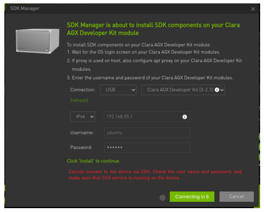

## Additional Resources

For other documentation and release notes, see the [Clara Holoscan SDK page](https://developer.nvidia.com/clara-holoscan-sdk).

For further Jetson documentation, see the [L4T documentation](https://docs.nvidia.com/jetson/l4t/index.html).

For feedback, discussion, and questions, please post to the Clara Holoscan SDK [Developer Forum](https://forums.developer.nvidia.com/c/healthcare/clara-holoscan-sdk/).

## Compliance Information

Please refer to [Clara AGX Developer Kit Compliance Information](https://developer.nvidia.com/clara-agx-developer-kit-compliance-information) documentation.

## Update Nvidia drivers

### Install CUDA APT keyring

```bash
wget https://developer.download.nvidia.com/compute/cuda/repos/ubuntu2004/sbsa/cuda-keyring_1.1-1_all.deb
sudo apt install ./cuda-keyring_1.1-1_all.deb
rm ./cuda-keyring_1.1-1_all.deb
sudo apt-get update
```

### Install drivers

`535` is the LTS version, but you can also install any other version shown by `apt policy cuda-drivers`, or just `cuda-drivers` with no version string to install the latest drivers:

```bash
sudo apt install cuda-drivers="535.*"
sudo reboot
```

> **Note:** if you'd like to install the open kernel module flavor, you'll still need to list the `cuda-drivers` package, as following [the regular instructions to switch flavor](https://docs.nvidia.com/datacenter/tesla/driver-installation-guide/#switching-between-driver-module-flavors) would uninstall the L4T BSP packages which depend on `cuda-drivers` explicitly.
>
> ```bash
> # Example for 560 drivers
> sudo apt install cuda-drivers="560.*" nvidia-driver-560-open
> sudo reboot
> ```
> 
> For `535` that is even more tricky, as the CUDA APT repository does not include the `nvidia-driver-535-open` package. It is available from Canonical/Ubuntu servers instead, but with strict dependencies versions that precede what the NVIDIA repository provides (`535.183.01-0ubuntu0.20.04.1` instead of `535.183.06-0ubuntu1`) and APT cannot resolve it automatically and will error out with `Unmet dependencies` when running the command above. If you must use `535-open`, explicitly add all the dependencies listed by `Unmet dependencies / Depends:` suffixed with `=="535.183.01-0ubuntu0.20.04.1"` to your `apt install` command.

**Known Limitation**: If you run into an error like this:

   ```
   Depends: cuda-drivers-XXX (>= XXX.YYY.ZZZ) but it is not going to be installed
   ```

Try to upgrade your current drivers to the latest minor version before upgrading the major version:

   ```bash
   # Example: if you are on 535.161.08 and want to upgrade to 560, you might need to upgrade to the latest 535 first
   sudo apt install cuda-drivers="535.*"

   # Now try upgrading to 560 again
   sudo apt install cuda-drivers="560.*" nvidia-driver-560-open
   sudo reboot
   ```

### Validate Version

Run `nvidia-smi` after reboot to confirm your driver version.

```
+---------------------------------------------------------------------------------------+
| NVIDIA-SMI 535.183.06             Driver Version: 535.183.06   CUDA Version: 12.2     |
|-----------------------------------------+----------------------+----------------------+
| GPU  Name                 Persistence-M | Bus-Id        Disp.A | Volatile Uncorr. ECC |
| Fan  Temp   Perf          Pwr:Usage/Cap |         Memory-Usage | GPU-Util  Compute M. |
|                                         |                      |               MIG M. |
|=========================================+======================+======================|
|   0  Quadro RTX 6000                On  | 00000000:09:00.0  On |                  Off |
| 33%   34C    P8              16W / 260W |     51MiB / 24576MiB |      1%      Default |
|                                         |                      |                  N/A |
+-----------------------------------------+----------------------+----------------------+
```

To print the driver version only, you can run:

```bash
$ nvidia-smi --query-gpu=driver_version --format=csv,noheader
535.183.06
```
