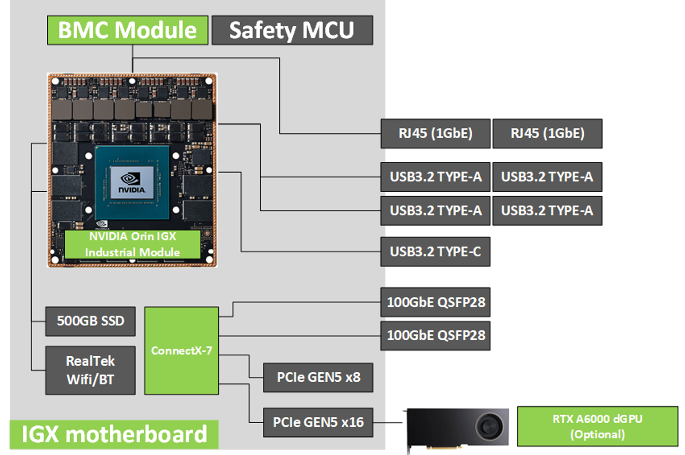
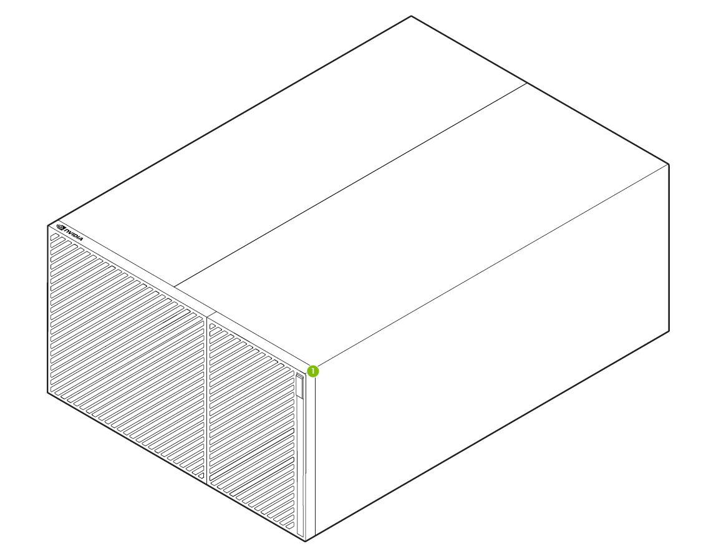
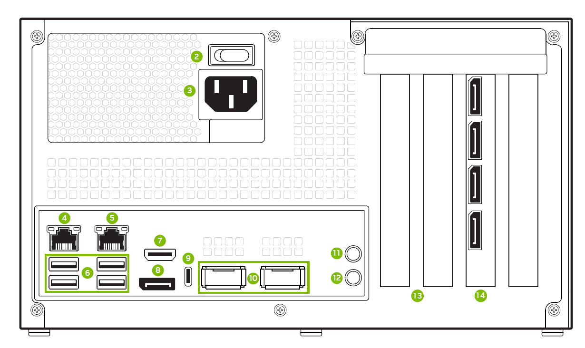
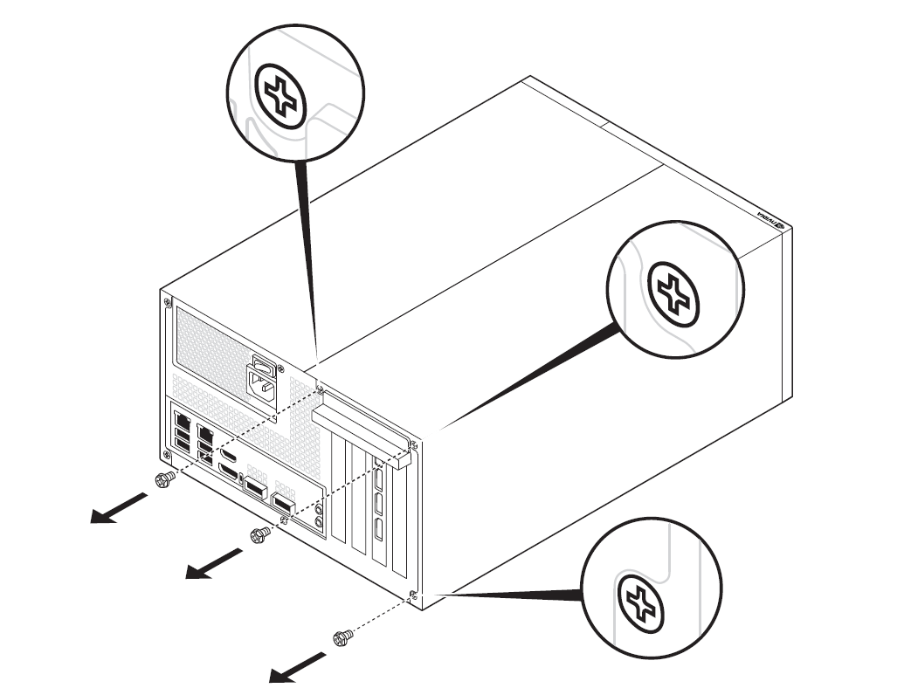
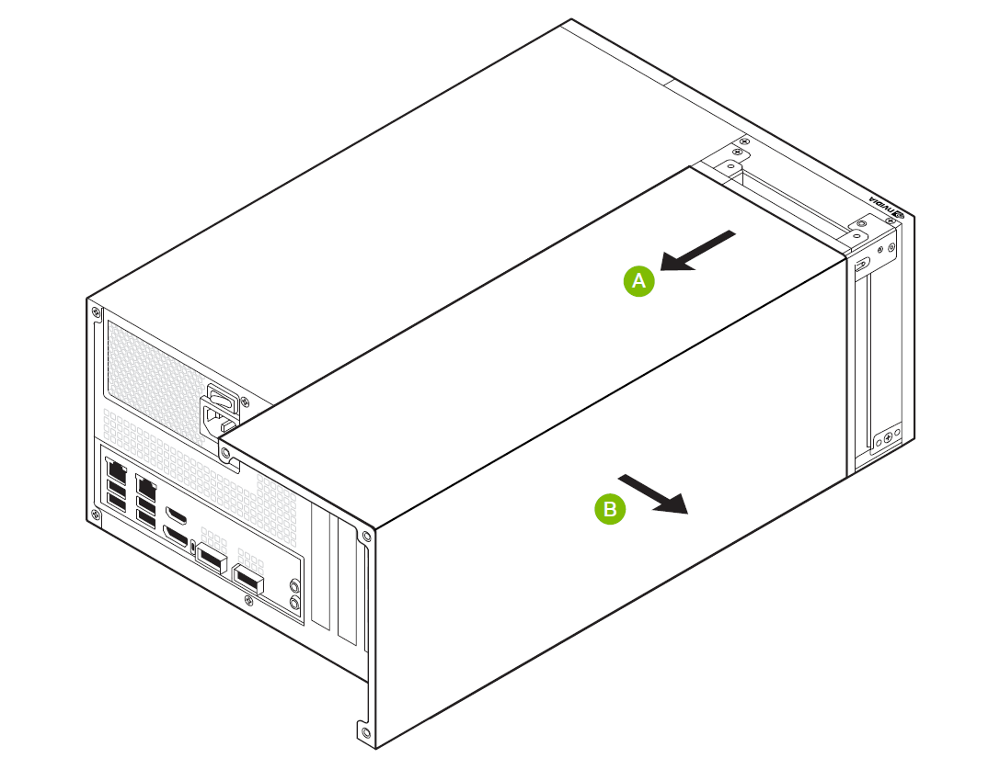
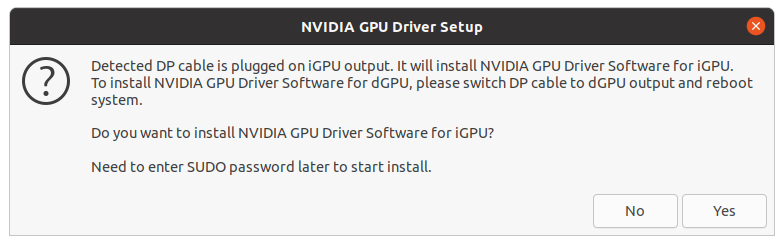
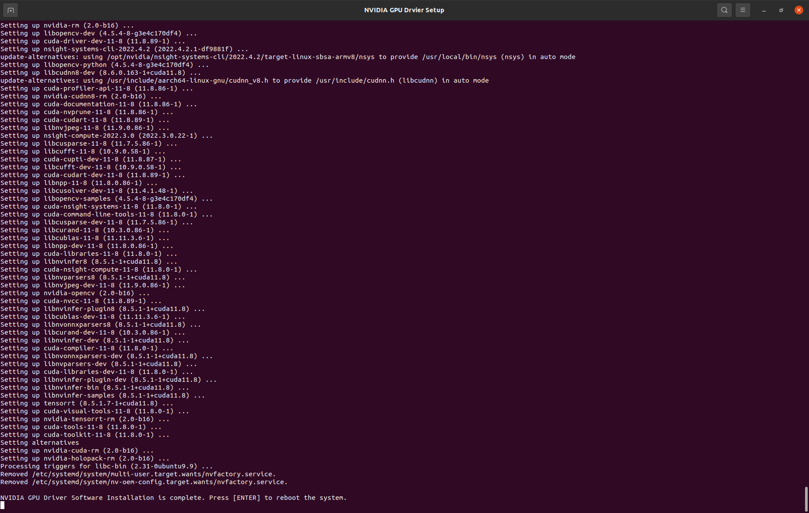

# NVIDIA IGX Orin Developer Kit User Guide

**Purpose:** Provides the instructions to flash, setup, and start using a NVIDIA IGX Orin Developer Kit.

**Disclaimer: The NVIDIA IGX Orin Developer Kit is not an approved medical device and is not**
**intended for clinical use.**

**Version:** 1.0
> Refer to [this PDF user guide](https://developer.download.nvidia.com/CLARA/IGX-Orin-Developer-Kit-User-Guide-(v1.0).pdf) for the `Early Sample [ES]` version of the IGX Orin Developer Kit. Please note we do not plan to continue updating the ES user guide.

## Contents

After receiving the NVIDIA IGX Orin Developer Kit, please make sure to read through and follow each of the sections to set up your Developer Kit.

1. [Configurations](#configurations)
    - [Environments](#environments)
    - [GPU Modes](#gpu-modes)
2. [System Overview](#system-overview)
    - [Main Components](#main-components)
    - [Tech Specs](#tech-specs)
    - [I/O and External Interfaces](#io-and-external-interfaces)
    - [Precautions](#precautions)
    - [Physical Installation of Additional Optional Cards](#physical-installation-of-additional-optional-cards)
3. [Powering Up the System](#powering-up-the-system)
4. [Setting up the System](#setting-up-the-system)
    - [As a Development Machine](#as-a-development-machine)
        - [Interactive Installation of Holopack](#interactive-installation-of-holopack)
        - [Checking the Currently Installed GPU Stack](#checking-the-currently-installed-gpu-stack)
        - [Switching Between iGPU and dGPU Stacks](#switching-between-igpu-and-dgpu-stacks)
        - [Re-flashing the Development Machine (Not Required at Initial Setup)](#re-flashing-the-development-machine)
    - [As a Deployment Machine](#as-a-deployment-machine)
5. [Setting up the SSD and Docker](#setting-up-the-ssd-and-docker)
    - [Setting up the SSD Storage](#setting-up-the-ssd-storage)
        - [Create a Partition](#create-a-partition)
        - [Mount the Partition](#mount-the-partition)
    - [Setting Up Docker Storage on the SSD](#setting-up-docker-storage-on-the-ssd)
6. [Accessing and Utilizing the BMC](#accessing-and-utilizing-the-bmc)
    - [Accessing the BMC](#accessing-the-bmc)
    - [Putting the System into Recovery Mode via BMC](#putting-the-system-into-recovery-mode-via-bmc)
    - [Accessing the SoC's UART from the BMC](#accessing-the-socs-uart-from-the-bmc)
7. [Install the Holoscan SDK](#install-the-holoscan-sdk)
8. [Troubleshooting](#troubleshooting)
9. [Additional Resources](#additional-resources)


## Configurations

### Environments

There are two environment types supported by the NVIDIA IGX Orin Developer Kit. If you're just getting started with the Developer Kit, you will likely want to go with option 1: development stack.

1. A **development stack** with a Ubuntu OS and desktop environment. It is based on HoloPack and designed for development and testing with the Holoscan SDK.
2. As **deployment stack** with an OpenEmbedded/Yocto layer for optimized deployment of Holoscan applications.

Visit the [Holoscan GitHub](https://github.com/nvidia-holoscan) for more information on the two environment types.

### GPU modes

There are two GPU modes available with the NVIDIA IGX Orin Developer Kit:

- using the **NVIDIA Ampere integrated GPU** (iGPU) on the NVIDIA IGX Orin module
- using an optional **NVIDIA RTX A6000 discrete GPU** (dGPU) connected to a PCIe slot of the developer kit

> Note: at this time, iGPU and dGPU drivers cannot both be loaded at once. For now, we provide the [L4T Compute Assist](https://catalog.ngc.nvidia.com/orgs/nvidia/teams/clara-holoscan/containers/l4t-compute-assist) container on NGC to utilize the iGPU for computation while the developer kit is configured in dGPU mode.

## System Overview

### Main Components

The NVIDIA IGX Orin Developer Kit contains the following major components:

- NVIDIA IGX Orin Industrial Module
  - ARM A78AE CPU Complex
  - NVIDIA Ampere iGPU
- NVIDIA BMC Module
- NVIDIA ConnectX-7
  - 32 lanes of up to PCIe Gen5 w/ integrated PCIe Switch
  - 2x QSFP28 100GbE Ethernet
- Safety MCU
- 500GB SSD
- Realtek WiFi / BT Module
- Optional NVIDIA RTX A6000 dGPU


### Technical Specifications

|                    |                                                                                                                                                                                                                                                                       |
| ------------------ | --------------------------------------------------------------------------------------------------------------------------------------------------------------------------------------------------------------------------------------------------------------------- |
| **GPU**            | Integrated GPU, NVIDIA Ampere architecture, 2048 NVIDIA® CUDA® cores, 64 Tensor Cores; <br>Optional Additional Discrete GPU, NVIDIA RTX A6000, NVIDIA Ampere architecture, 48 GB GDDR6 Memory, 768 GB/s Memory Bandwidth, 10752 NVIDIA® CUDA® cores, 336 Tensor Cores |
| **CPU**            | 12-core Arm® Cortex®-A78AE v8.2 64-bit CPU 3MB L2 + 6MB L3                                                                                                                                                                                                            |
| **DL accelerator** | 2x NVDLA 2.0 Engines                                                                                                                                                                                                                                                  |
| **Memory**         | 64GB 256-bit LPDDR6 (3200 MHz)                                                                                                                                                                                                                                        | 204.8 GB/s |
| **Storage**        | 500GB SSD                                                                                                                                                                                                                                                             |
| **I/O**            | (4x) USB3.2 Type-A, (1x) USB3.2 Type-C, <br>(1x) HDMI in (There is no display output from the HDMI port), <br>(1x) DisplayPort output, <br>(2x) 100 GbE QSFP28, <br>(2x) 1GbE RJ45, <br>(2x) 3.5mm AU jack (Line-out, MIC)                                                                                            |
| **Expansion**      | (1x) PCIe Gen5 single width slots(x8 connected),  <br>(1x) PCIe Gen5 double width slot(x16 connected) for Optional RTX A6000 for additional performance                                                                                                               |
| **Power Supply**   | 850 W, 100-240 V                                                                                                                                                                                                                                                      |
| **Dimensions**     | 262.7 mm W x 151.2 mm H x 382.0 mm L                                                                                                                                                                                                                                  |

### I/O and External Interfaces

| Front View                 | Back View                  |
| -------------------------- | -------------------------- |
|  |  |

1. Power button
2. Power switch
3. Power cable connection
4. 1GbE RJ45 with connection to the Orin CCPLEX
5. 1GbE RJ45 with connection to the Orin CCPLEX and BMC
6. (4x) USB 3.2 Gen2 Type A
7. HDMI-In (There is no display output from the HDMI port)
8. DisplayPort output from Tegra
9. USB 3.2 Gen2 Type C connector
10. (2x) QSFP28 ports (up to 100GbE per port)
11. Line-Out
12. MIC
13. PCIe Gen5 single width slots(x8 connected)
14. PCIe Gen5 double width slot(x16 connected) for Optional RTX A6000.
    - There will be (4x) DisplayPorts on this slot if you selected the additional RTX A6000 when ordering from one of our distributors.

For steps to remove the cover and access slot 13, please see section [Physical Installation of Additional Optional Cards](#physical-installation-of-additional-optional-cards).

### Precautions

- Only connect or disconnect a PCIe card (e.g. miniSAS or dGPU) when the system is powered down.
- Apply extra care when plugging and removing PCIe cards to avoid stress on the PCIe connectors (wearing, bending, breaking).

### Physical Installation of Additional Optional Cards

To install additional cards PCIe cards, first remove the cover.

See the illustrations below for direction. First, remove the three screwson the right side when facing the back panel.


Next, remove the cover as illustrated in the direction of A and B. The movement in the direction of A should be around 0.5 inch, or less than 1.5 cm.

Once the cover is lifted off, remove the screws on top of slot (13), install the card on the PCIe slot (13), and now the IO from the PCIe card can be accessed from the developer kit back panel.

## Powering up the System

1. Connect all peripherals to the system before powering up the system.
    - Depending on whether the optional RTX A6000 is installed, connect the DisplayPort cable either to the DP port for the Orin module, or to one of the four DP ports on the RTX A6000 GPU.
2. Connect the power cable to the system at port (3).
3. Once the power cable is connected, toggle to power switch at port (2) to ON, press the power button at port (1) for around 1 second. It should light up.

**Note** : The machine can be powered off by pressing the power button for approximately 10 seconds.

## Setting up the System
Note: If your system is currently flashed with the deployment stack, and you would like to use it as a development machine with L4T Holopack, [re-flashing the machine](#re-flashing-the-development-machine) is required.

### As a Development Machine

Once you receive your NVIDIA IGX Orin Developer Kit, it should **already be pre-flashed with a base image of Holopack**, so you can follow the [interactive installation guide](#interactive-installation-of-holopack) below to complete the setup before using your developer kit. You can also [re-flash your system](#re-flashing-the-development-machine) if the need arises.

#### Interactive Installation of Holopack

You will need the following to continue setting up the developer kit as a development machine:

- A compatible power cable
  - The NVIDIA IGX Orin Developer Kit may not include a power cable compatible with your local electrical requirements.
- Connection to the internet
- A keyboard, mouse, and monitor with DisplayPort

**Note** : The HDMI port above the display port is for input only. Do not plug a monitor into the HDMI port.

[Power up the system](#powering-up-the-system), and you should see the OS booting. Follow the next steps to continue setting up your L4T system:

1. Make sure the developer kit has a connection to the internet via one of the RJ-45 Ethernet ports.
2. Make sure the DisplayPort cable is connected to the right port. You should see the System Configuration window on the display after booting.
    - If you have a IGX Orin Developer Kit without an additional RTX A6000 GPU, connect to DP at port (8).
    - If you have the addition RTX A6000 GPU installed, connect to one of the four DP ports on slot (14).

3. Set up System Configuration: accept the L4T_End_User_License_Agreement, select system language, select keyboard layout, select timezone, set up you username and password, and enter the APP partition size.
4. The system will reboot now. Once prompted, log in with the username and password you have just set up. You should be in the Ubuntu desktop now, and there should be a prompt popping up.

**Note** : If the display port is attached to the discrete GPU and you do not see the NVIDIA splash screen during reboot, the GPU firmware must be updated. Contact the NVIDIA support forum for assistance.

5. Each developer kit can only have either the iGPU stack or the dGPU stack installed, not both at the same time. If your developer kit has a RTX A6000, you can install the dGPU stack (or the iGPU stack, but that means the RTX A6000 will not be utilized at all). Otherwise, the developer kit is only compatible with the iGPU stack.

    The prompt will ask if you want to install the GPU stack that is detected based on the DP cable connection. If you accidentally had the DP cable connected to port (8) when you have the dGPU installed, the prompt will ask if you want to install the iGPU stack, click no, connect to one of the four DP ports on slot (14), then reboot to see the prompt asking to install the dGPU stack.

    Click yes to continue if you want to install the dGPU software:

    

    Click yes to continue if you want to install the iGPU software:

    

    Enter the password when prompted on the terminal. It will installing CUDA, TensorRT, cuDNN, and GPU drivers.
6. The end of the installation will look like this:

    

7. Reboot as prompted, and now you're ready to use your IGX Orin Developer Kit!

#### Checking the Currently Installed GPU Stack

To check for which GPU stack you have installed on your system, run `$ lsmod | grep nv`.
If iGPU stack is installed, the results should contain `nvgpu`:

```sh
$ lsmod | grep nv
nvidia_modeset       1093632  6
nvadsp                110592  1 snd_soc_tegra210_adsp
nvidia               1339392  13 nvidia_modeset
nvgpu                2494464  32
nvmap                 192512  146 nvgpu
```

Use the **nvidia-smi** command to validate that the dGPU software stack installed successfully:

```sh
$ nvidia-smi
Wed Mar  1 19:13:09 2023
+-----------------------------------------------------------------------------+
| NVIDIA-SMI 520.61.05    Driver Version: 520.61.05    CUDA Version: 11.8     |
|-------------------------------+----------------------+----------------------+
| GPU  Name        Persistence-M| Bus-Id        Disp.A | Volatile Uncorr. ECC |
| Fan  Temp  Perf  Pwr:Usage/Cap|         Memory-Usage | GPU-Util  Compute M. |
|                               |                      |               MIG M. |
|===============================+======================+======================|
|   0  NVIDIA RTX A6000    On   | 00000005:09:00.0  On |                  Off |
| 30%   39C    P8    14W / 300W |     50MiB / 49140MiB |      0%      Default |
|                               |                      |                  N/A |
+-------------------------------+----------------------+----------------------+

+-----------------------------------------------------------------------------+
| Processes:                                                                  |
|  GPU   GI   CI        PID   Type   Process name                  GPU Memory |
|        ID   ID                                                   Usage      |
|=============================================================================|
|    0   N/A  N/A      1301      G   /usr/lib/xorg/Xorg                 40MiB |
|    0   N/A  N/A      1465      G   /usr/bin/gnome-shell                7MiB |
+-----------------------------------------------------------------------------+
```

#### Switching between iGPU and dGPU Stacks

If you have the additional RTX A6000 dGPU in your system and would like to switch between the iGPU stack and dGPU stack, [re-flashing](#re-flashing-the-development-machine) is required at this time.

#### Re-flashing the Development Machine

As the developer kit is already pre-flashed with a base image when you unbox it, **re-flashing is only required in the case the machine is in an non-operational state**. There are a few options for re-flashing:

1. NVIDIA SDK Manager (Recommended).
2. Manual flashing with files downloaded from DevZone.

Please see the subsections below for each of the three re-flashing methods.

You will need the following to continue with re-flashing:

- A compatible power cable
  - The NVIDIA IGX Orin Developer Kit may not include a power cable compatible with your local electrical requirements.
- Connection to the internet
- A keyboard, mouse, and monitor with DisplayPort
- An Ubuntu host system with USB port
- A standard USB-A to USB-C cable with data enabled (this should come with the Developer Kit box)
- Connection to the internet for the host system

##### Re-flashing Option 1 - with NVIDIA SDK Manager

1. Register and activate an NVIDIA Developer Account for the [Holoscan SDK Program](https://developer.nvidia.com/clara-holoscan-sdk-program) to access the latest version of Holopack in SDK Manager. Optionally apply to the NVIDIA Rivermax SDK [Developer Program](https://developer.nvidia.com/nvidia-rivermax-sdk).
2. If you are running a VPN on your host system, log off before flashing the NVIDIA IGX Orin Developer Kit.
3. Using a VM as your host machine isn't officially supported, but it is possible with certain
   VMs such as VMWare Workstation 16 running Ubuntu 18.04. We haven't had success using VirtualBox as the host machine. If using a VM, ensure the USB port that
   connects to the USB-C port on the NVIDIA IGX Orin Developer Kit is always routed to the VM.
4. From the host system, download and install the latest version of [NVIDIA SDK Manager](https://developer.nvidia.com/nvidia-sdk-manager). Instructions for downloading and setting up NVIDIA SDK Manager can be found [here](https://docs.nvidia.com/sdk-manager/download-run-sdkm/index.html). **Make sure to log in with the same developer account in SDK Manager.**

5. Connect the NVIDIA IGX Orin Developer Kit to the host system via USB-C on port (9).

6. From the NVIDIA SDK Manager, download and flash the NVIDIA IGX Orin Developer Kit.

    This will flash the system as well as install Holopack, so there is no need to do [interactive installation of Holopack](#interactive-installation-of-holopack) after.

    - If you joined the Holoscan SDK program after your initial SDK Manager login,
      you will need to log out and log in again on SDK Manager for the permissions to take effect.

    We recommend setting the unit to recovery mode via BMC before the flashing process and selecting
    "Manual Setup" mode in the prompt at Step 03 in the SDK Manager. See subsction [Putting the System into Recovery Mode via BMC](#putting-the-system-into-recovery-mode-via-bmc) for steps.

   If you choose to select "Automatic Setup" instead of "Manual Setup" and not put the unit into recovery mode, the username/password should be the combination you had previously set up prior to re-flashing.

    See the [SDK Manager step-by-step instructions](https://docs.nvidia.com/sdk-manager/install-with-sdkm-clara/index.html) for detailed instructions.

    If you run into the error `ERROR: might be timeout in USB write` during flashing, please see [troubleshooting](#troubleshooting-1-usb-timeout-error-during-re-flashing).

##### Re-flashing Option 2 - Manual

1. Download the files `Jetson_Linux_R35.3.2_aarch64.tbz2` and `Tegra_Linux_Sample-Root-Filesystem_R35.3.2_aarch64.tbz2` [from NVIDIA DevZone](https://developer.nvidia.com/downloads/holoscan/igx_devkit_factory_image.zip/) to your x86 host system. Unzip the zip file.
2.

   ```sh
   tar xvf Jetson_Linux_R35.3.2_aarch64.tbz2
   ```

3.

   ```sh
   cd Linux_for_Tegra/rootfs/
   ```

4.

   ```sh
   sudo tar xvf ../../Tegra_Linux_Sample-Root-Filesystem_R35.3.2_aarch64.tbz2
   ```

5.

   ```sh
   cd ..
   sudo ./apply_binaries.sh --factory
   ```

6. Connect the NVIDIA IGX Orin Developer Kit to the host system via USB-C on port (9).
7. Put devkit into recovery mode (see [Putting the System into Recovery Mode via BMC](#putting-the-system-into-recovery-mode-via-bmc))
8. Flash the developer kit

   ```sh
   sudo env ADDITIONAL_DTB_OVERLAY="DgpuDtEfifbSupport.dtbo" ./flash.sh igx-orin-devkit internal
   ```
   If you run into the error `ERROR: might be timeout in USB write` during flashing, please see [troubleshooting](#troubleshooting-1-usb-timeout-error-during-re-flashing).
9. Continue to [set up the developer kit as a development machine](#as-a-development-machine) and [interactively install Holopack](#interactive-installation-of-holopack).

### As a Deployment Machine

See the resources under `Deployment Software Stack` on the [Holoscan GitHub page](https://github.com/nvidia-holoscan) for setting up the developer kit with the deployment stack. You will need the following to continue setting up the developer kit as a development machine:

- A compatible power cable
  - The NVIDIA IGX Orin Developer Kit may not include a power cable compatible with your local electrical requirements.
- Connection to the internet
- A keyboard, mouse, and monitor with DisplayPort

- An Ubuntu host system with USB port
- A standard USB-A to USB-C cable with data enabled (this should come with the Developer Kit box)
- Connection to the internet for the host system

If setting up with the deployment stack, you will not need to follow the next section [Setting up the SSD and Docker](#setting-up-the-ssd-and-docker).

## Setting up the SSD and Docker

The IGX Orin Developer Kit includes a 500GB solid-state drive (SSD), though this drive is not partitioned or mounted by default. Since a complete installation of HoloPack leaves about 40-50GB of storage remaining in the root 64GB, you need to set up your SSD storage and move the docker storage to it to avoid filling up the root directory rapidly with Docker image pull operations.

### Setting up the SSD Storage

This section outlines the steps to partition and format the drive for use after the initial HoloPack installation.

> **Note**: If the developer kit is re-flashed with a new HoloPack image, the partition table of the m.2 drive will not be modified and the contents of the partition will be retained. In this case, you can skip the [Create Partition](#create-a-partition) steps; however, you should still follow the [Mount Partition](#mount-the-partition) steps to remount the partition. Any state, binaries, or docker images that persist on the m.2 drive after flashing the system may be incompatible with new libraries or components that are flashed onto the system. You may need to recompile or rebuild these persistent objects to restore runtime compatibility with the system.

The following steps assume that the m.2 drive is identified by the IGX Orin Developer Kit as `/dev/nvme0n1`. This is the case if no additional drives have been attached, but if other drives (such as USB drives) have been attached, then the disk identifier may change. You can verify this by looking at the symlink to the drive that is created for the m.2 hardware address on the system. If the symlink below shows something other than `../../nvme0n1`, replace all instances of `nvme0n1` in the instruction below with the identifier that is being used by your system:

```sh
$ readlink /dev/disk/by-path/platform-14160000.pcie-pci-0004\:01\:00.0-nvme-1
../../nvme0n1
```

#### Create a Partition

1. Create a partition table:

   ```sh
   sudo parted -a optimal /dev/nvme0n1 mklabel gpt
   ```

2. Create a new primary partition:

   ```sh
   sudo parted -a optimal /dev/nvme0n1 mkpart primary ext4 0% 100%
   ```

3. Initialize the ext4 filesystem on the new partition:

   ```sh
   sudo mkfs -t ext4 /dev/nvme0n1p1
   ```

#### Mount the Partition

1. Create a directory for the mount point. These instructions will use the path `/media/m2`, but any path can be used.

   ```sh
   sudo mkdir /media/m2
   ```

2. Determine the UUID of the new partition
following output shows that the UUID of the `/dev/nvme0n1p1` partition is `7f41ff99-6b67-4e5c-af16-7af409579440`:

   ```sh
   $ sudo blkid -s UUID -o value /dev/nvme0n1p1
   7f41ff99-6b67-4e5c-af16-7af409579440
   ```

3. Add the fstab entry. Using the mount path and the UUID from the previous steps, add
the following line to the end of `/etc/fstab`:

   ```sh
   # <file system>                           <mount point> <type> <options> <dump> <pass>
   ...
   UUID=7f41ff99-6b67-4e5c-af16-7af409579440 /media/m2     ext4   defaults  0      2
   ```

4. Mount the partition. The `/etc/fstab` entry above will mount the partition
automatically at boot time. To instead mount the partition immediately without
rebooting, use the mount command (and df to verify the mount):

   ```sh
   $ sudo mount –a
   $ df -h /dev/nvme0n1p1
   Filesystem      Size  Used Avail Use% Mounted on
   /dev/nvme0n1p1  458G   73M  435G   1% /media/m2
   ```

5. Manage permission on SSD. For example, use the `chmod` command to manage file system access permission.

### Setting Up Docker Storage on the SSD

1. Install [Docker](https://docs.docker.com/engine/install/ubuntu/) and [NVIDIA Container Toolkit](https://docs.nvidia.com/datacenter/cloud-native/container-toolkit/install-guide.html) if they have not been installed on your system.

2. Create a Docker data directory on the new m.2 SSD partition. This is where Docker will store all of its data, including build cache and container images. These instructions use the path `/media/m2/docker-data`, but you can use another directory name if preferred.

   ```sh
   sudo mkdir /media/m2/docker-data
   ```

3. Configure Docker by writing the following to `/etc/docker/daemon.json`:

   ```json
   {
       "runtimes": {
           "nvidia": {
               "path": "/usr/bin/nvidia-container-runtime",
               "runtimeArgs": []
           }
       },
       "default-runtime": "nvidia",
       "data-root": "/media/m2/docker-data"
   }
   ```

4. Restart the Docker daemon:

   ```sh
   sudo systemctl daemon-reload
   sudo systemctl restart docker
   ```

5. Add the current user to the Docker groupso Docker commands can run without `sudo`.

   ```sh
   # Create the docker group.
   sudo groupadd docker
   # Add your user to the docker group.
   sudo usermod -aG docker $USER
   # Activate the changes to groups. Alternatively, reboot or re-login.
   newgrp docker
   ```

6. Verify that you can run a "hello world" container.

   ```sh
   docker run hello-world
   ```

## Accessing and Utilizing the BMC

Accessing and utilizing the BMC is an advanced feature of the IGX Orin Developer Kit, which can be extremely helpful during your development journey. Please note that following this section isn't mandatory for the initial setup of your Developer Kit.

The Baseboard Management Controller (BMC) is a small and specialized process that provides remote management capabilities. The key advantage of a BMC is that allows a system administrator to perform many different monitoring and management tasks remotely – such as power cycling, installing BIOS or firmware updates, and monitoring fan speeds and temperatures.

Here we show how to access the BMC on the IGX Orin Developer Kit from another machine, put the developer kit into recovery mode, and access the SoC's OS.

### Accessing the BMC
1. Connect your Ubuntu host machine and the developer kit with an ethernet cable. Make sure it's port (5), the right side one of the two ethernet ports.
2. Find out which ethernet adapter on the Ubuntu host machine is connected. Run `ifconfig` to see a list of all active interfaces details. For example it could be `eth0`.
3. Configure Ubuntu host machine as DHCP host.

    3.1. Install DHCP server on host using
    ```
    sudo apt-get install isc-dhcp-server
    ```
    3.2. Add a block to the end of the Ubuntu host machine's DHCP config file `/etc/dhcp/dhcpd.conf` as per below
    ```
    subnet 192.168.1.0 netmask 255.255.255.0 {
        range 192.168.1.100 192.168.1.200;
        option routers 192.168.1.1;
        option broadcast-address 192.168.1.255;
    }
    ```
    Here the subnet can be another logical IP gateway as well; range specifies the available IP pool and the client can have IP in this range only; the optional routers IP address is the IP address of the Ubuntu host machine, here it is `192.168.1.1`.

4. Assigned your host ethernet adapter a static IP address specified above, `192.168.1.1`. The command would look like below if the ethernet adapter on host is `eth0`, please use the name you found in step 2 after running `ifconfig`.
    ```
    sudo ifconfig eth0 192.168.1.1 netmask 255.255.255.0
    ```
5. Restart the DHCP server
    ```
    sudo systemctl restart isc-dhcp-server
    ```
6. Ping the developer kit from the host machine to ensure connection
    ```
    ping 192.168.1.110
    ```
    If you cannot successfully ping, make sure port (4) isn't connected to the internet and reboot the developer kit. Then start from step 1.

7. ssh into the BMC
    ```
    ssh root@192.168.1.110
    ```
    The original password is `0penBmc`, note it's the number zero `0` and not the letter `o` or `O`. When prompted, change it to a password of your choice after logging in.

### Putting the System into Recovery Mode via BMC

Putting the system into recovery mode isn't needed unless you need to re-flash the system with a new base image or flash the system with the deployment stack. You will want to put it into recovery mode before flashing.

First [access the BMC](#accessing-the-bmc) via steps 1-4. Next, put the developer kit into recovery mode by `powerctrl recovery`. The BMC terminal should look like:

```
root@mgx-3809:~# powerctrl recovery
Host Power Control
Host Recovery...
Resetting Host...
root@mgx-3809:~#
```

If the USB-C port (9) of the NVIDIA IGX Orin Developer Kit is connected to a USB port of the host system, you can confirm that the Developer Kit is in recovery mode if it is listed when running `lsusb` on the host:

```sh
$ lsusb | grep NVIDIA
Bus 003 Device 003: ID 0955:7023 NVIDIA Corp. APX
```

### Accessing the SoC's UART from the BMC

From the BMC, we can access the SoC via [UART](https://en.wikipedia.org/wiki/Universal_asynchronous_receiver-transmitter). We may need to access the SoC this way to perform one-time tasks on the SoC, retrieve the IP address of the SoC when it's not possible to SSH into it, or for other troubleshooting purposes.

First [access the BMC](#accessing-the-bmc) via steps 1-4. Next, enter the following two commands in BMC

```
root@mgx-3809:~# gpioset -m exit `gpiofind "bmc_gpio_n1"`=1
root@mgx-3809:~# /usr/sbin/obmc-console-server --config /etc/obmc-console/obmc-console-3809.conf ttyS2 &
```

The terminal should look like

```
root@mgx-3809:~# /usr/sbin/obmc-console-server --config /etc/obmc-console/obmc-console-3809.conf ttyS2 &
 [1] 840
root@mgx-3809:~# 3 handlers
   log [active]
   socket [active]
Set ttyS2 for raw byte handling
   tty [active]

root@mgx-3809:~#
```

Press "enter" if it hangs at line `tty [active]`. Once you can enter the next command in the BMC terminal, enter

```
root@mgx-3809:~# /usr/bin/obmc-console-client
```

If you have set up a username/password before, enter when prompted. When sucessfully logged in, at machine setup time the terminal should look like

```
ubuntu@tegra-ubuntu:~$
```

or if you have already set up your desktop and username/password

```
your-username@your-desktop-name:~$
```

## Install the Holoscan SDK

Different installation strategies for the Holoscan SDK are listed in the SDK user guide's section [SDK Installation](https://docs.nvidia.com/clara-holoscan/sdk-user-guide/sdk_installation.html).

See [The Holoscan GitHub](https://github.com/nvidia-holoscan) for the full list of resources for NVIDIA Holoscan.

## Troubleshooting

### Troubleshooting 1: USB Timeout Error During Re-flashing

If you are re-flashing the developer kit via [option 1 - SDK Manager](#re-flashing-option-1---with-nvidia-sdk-manager) or [option 2 - manual](#re-flashing-option-2---manual), a USB-C connection to the developer kit is required from the host machine's USB port. If you are seeing an error similar to

```
[   0.1172 ] Sending bct_br
[   0.1603 ] ERROR: might be timeout in USB write.
Error: Return value
```

It is possible that your host machine's USB port isn't enabled. First try to move to a difference USB port on your host if available. If that doesn't help, try disabling autosuspend on your host machine's USB ports:

```sh
sudo bash -c 'echo -1 > /sys/module/usbcore/parameters/autosuspend'
```

Then retry flashing.

## Additional Resources

For other documentation and release notes, see the [NVIDIA Holoscan SDK developer page](https://developer.nvidia.com/holoscan-sdk).

For further Jetson documentation, see the [Jetson Software Documentation](https://docs.nvidia.com/jetson/).

For feedback, discussion, and questions on the SDK, please post to the [Holoscan SDK Developer Forum](https://forums.developer.nvidia.com/c/healthcare/holoscan-sdk/).

For feedback, discussion, and questions on the NVIDIA IGX Orin Developer Kit, please post to the [IGX Orin Developer Kit Developer Forum](https://forums.developer.nvidia.com/c/agx-autonomous-machines/igx-orin-developer-kit-support).
